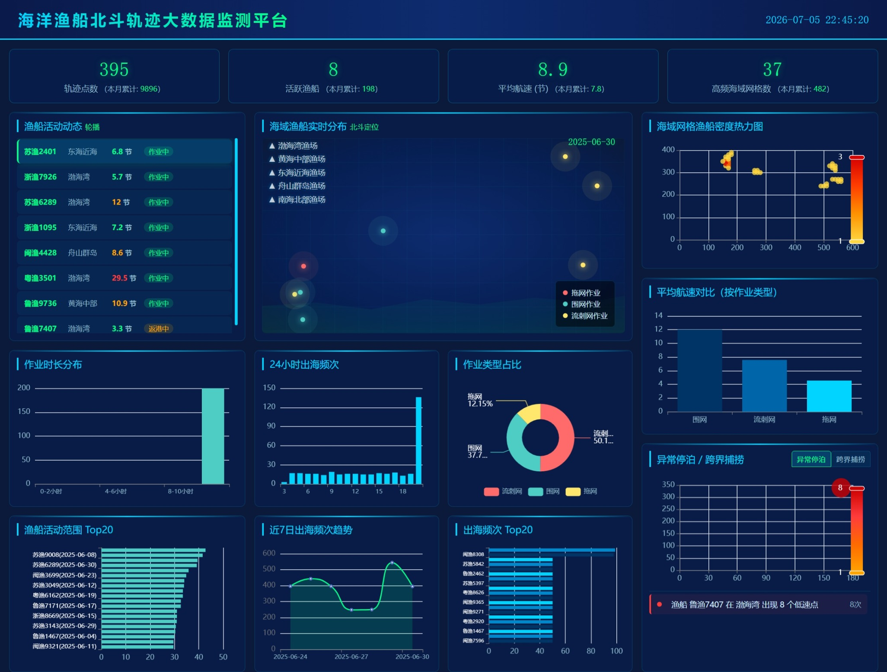
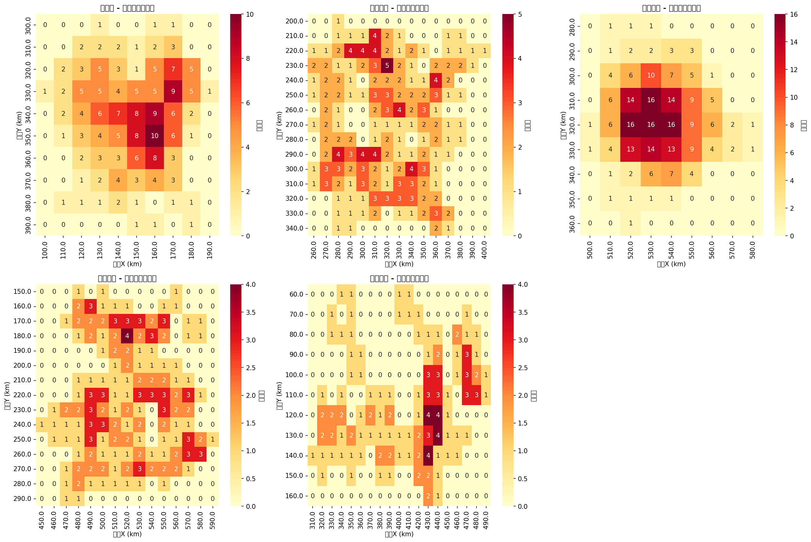
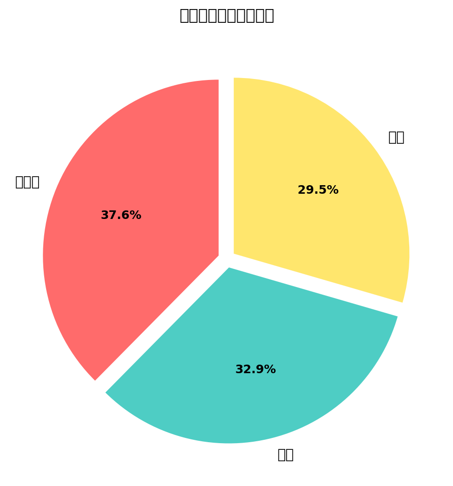
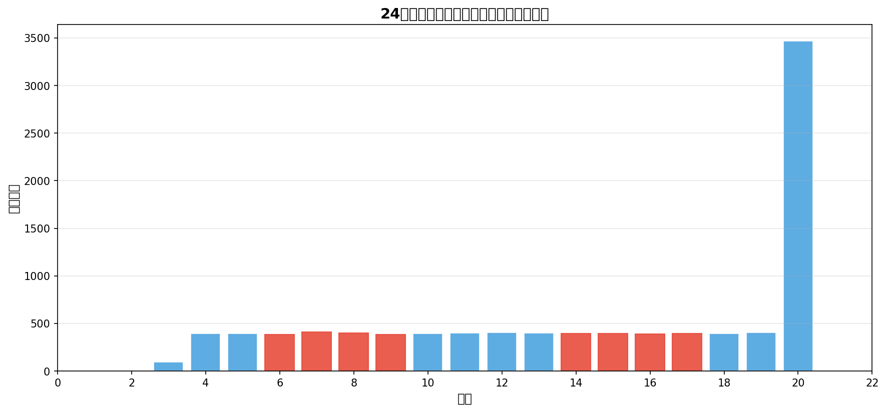
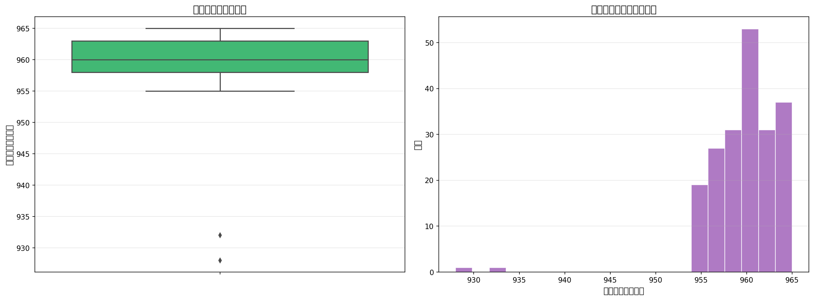
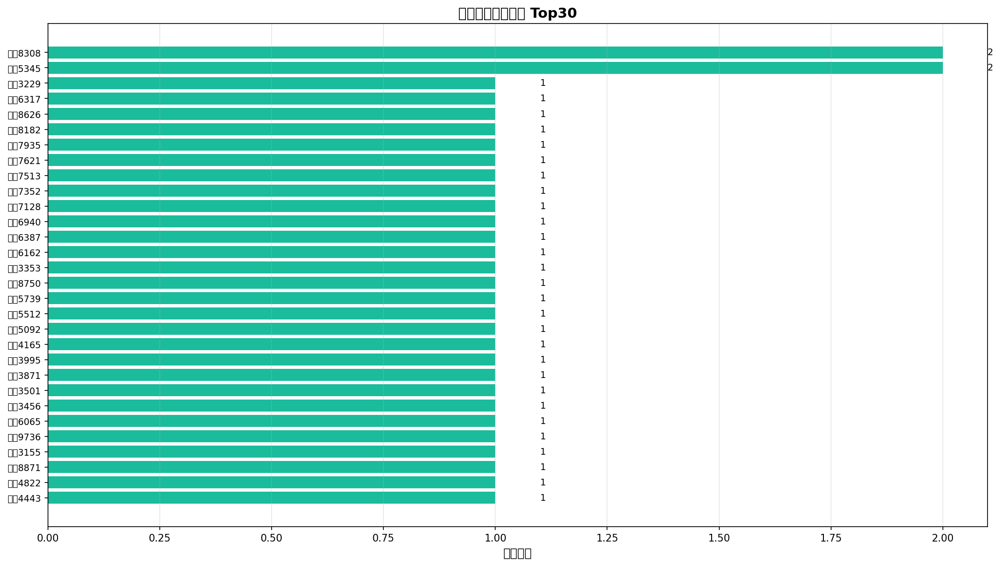
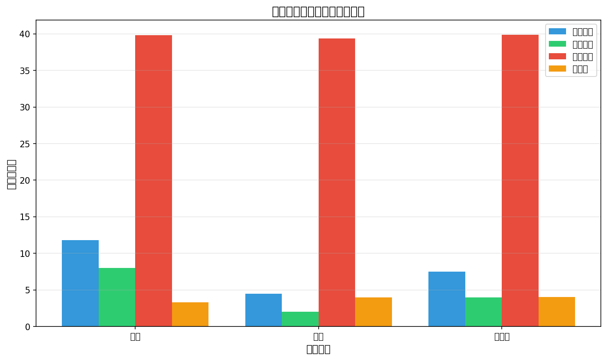
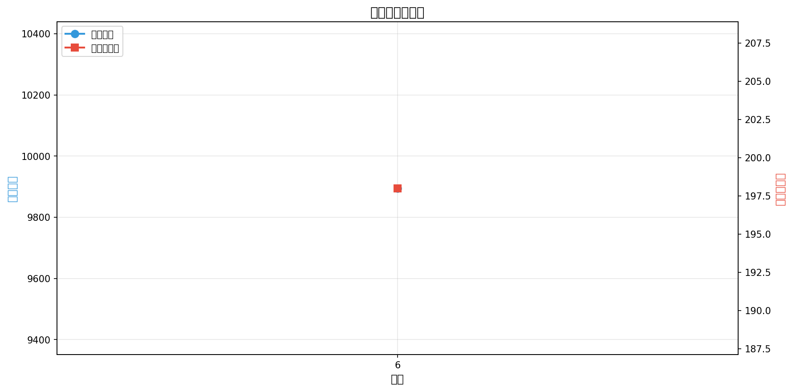
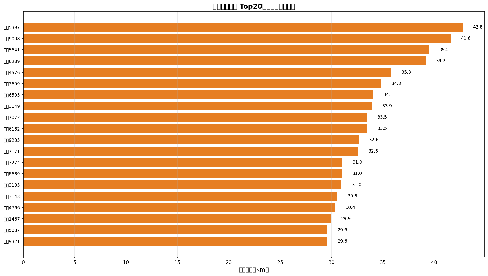

# 海洋渔船北斗轨迹大数据监测平台

基于 Hadoop/Hive 离线数仓与 Spark + Flask + ECharts 实时可视化的渔船轨迹分析系统，覆盖数据生成、数仓建模、指标计算到可视化展示的全链路。


## 项目背景

海洋渔船 AIS（自动识别系统）轨迹数据是渔业监管、海域态势感知和渔业资源管理的重要数据源。本平台针对渔船 AIS 轨迹数据，构建了一套从数据生成、离线数仓建模、指标计算到实时可视化监控的完整解决方案。

系统模拟 200 艘渔船在渤海湾、黄海中部、东海近海、舟山群岛、南海北部五个海域的航行轨迹，通过 Hive 完成 8 大业务指标计算，并通过 Spark + Flask + ECharts 搭建实时监控大屏，实现了从原始日志到业务洞察的完整闭环。


## 技术栈

| 层级 | 技术 | 说明 |
|------|------|------|
| 数据生成 | Python | 模拟 200 艘渔船 × 50 轨迹点，含 2% 异常值 |
| 分布式存储 | Hadoop HDFS | 原始 CSV 数据存储与 Hive 外部表映射 |
| 数据仓库 | Apache Hive | ODS→DWD→DWS→ADS 四层数仓建模 |
| 存储格式 | ORC + Snappy | 列式存储，压缩率约 70%，支持谓词下推 |
| 离线计算 | HiveQL | 8 大业务指标聚合计算 |
| 实时计算 | PySpark (Spark SQL) | 全量加载 Hive 数据，内存滑动窗口模拟实时流 |
| 后端服务 | Flask | RESTful API 服务，10+ 个接口 |
| 可视化（交互） | ECharts 5.4+ | 大屏图表、海图动态定位、轮播、预警联动 |
| 可视化（静态） | Matplotlib / Seaborn | 8 张统计图表输出（PNG） |
| 数据采集 | Flume（模拟） | 日志采集与 HDFS 落地 |
| 数据同步 | DataX / Python | HDFS ↔ MySQL 数据迁移 |
| 数据库 | MySQL | 指标结果存储 |


## 系统架构
┌─────────────────────────────────────────────────────────────────────────────┐
│                            数据生成层                                      │
│                                                                           │
│  01_data_generator.py  →  200艘渔船 × 50轨迹点  →  三种作业类型           │
│                                                                           │
│  输出：raw_ais_data.csv（含 2% 速度异常值）                                │
└─────────────────────────────────────────────────────────────────────────────┘
                                       │
                                       ▼
┌─────────────────────────────────────────────────────────────────────────────┐
│                            HDFS 存储层                                     │
│                                                                           │
│  /ocean/ais/raw/raw_ais_data.csv                                          │
│                                                                           │
│  Hive 外部表直接映射，不导入数据                                            │
└─────────────────────────────────────────────────────────────────────────────┘
                                       │
                                       ▼
┌─────────────────────────────────────────────────────────────────────────────┐
│                        Hive 离线数仓（四层建模）                            │
│                                                                           │
│  ┌──────┐      ┌──────┐      ┌──────┐      ┌──────┐                     │
│  │ ODS  │  →   │ DWD  │  →   │ DWS  │  →   │ ADS  │                     │
│  │原始层│      │明细层│      │汇总层│      │应用层│                     │
│  └──────┘      └──────┘      └──────┘      └──────┘                     │
│                                                                           │
│  存储格式：ORC + Snappy 列式存储  │  分区策略：按 dt（日期）分区           │
└─────────────────────────────────────────────────────────────────────────────┘
                                       │
                                       ▼
┌─────────────────────────────────────────────────────────────────────────────┐
│                         指标计算层（HiveQL）                               │
│                                                                           │
│  ① 海域网格密度   ② 作业类型占比   ③ 24h频次分布   ④ 作业时长分布         │
│  ⑤ 出海频次排名   ⑥ 平均航速对比   ⑦ 月度趋势       ⑧ 活动范围排名         │
└─────────────────────────────────────────────────────────────────────────────┘
                                       │
                                       ▼
┌─────────────────────────────────────────────────────────────────────────────┐
│                        可视化层（双轨输出）                                 │
│                                                                           │
│  ┌─────────────────────────┐    ┌─────────────────────────────────────┐   │
│  │  离线静态图（Matplotlib）│    │   实时交互大屏（ECharts + Flask）   │   │
│  │                         │    │                                     │   │
│  │  charts/ 目录           │    │  · 动态海图 + 渔船定位              │   │
│  │  8 张 PNG 统计图表       │    │  · 10+ 交互式图表                  │   │
│  └─────────────────────────┘    │  · 渔船轮播 + 异常预警              │   │
│                                 │  · 跨界捕捞标签切换                 │   │
│                                 └─────────────────────────────────────┘   │
└─────────────────────────────────────────────────────────────────────────────┘

text


## 核心功能

### 1. 数据生成与采集

- 模拟 200 艘渔船在 5 个海域（渤海湾、黄海中部、东海近海、舟山群岛、南海北部）的航行轨迹
- 支持三种作业类型：拖网（速度 2-6 节）、围网（速度 8-15 节）、流刺网（速度 4-10 节）
- 内置 2% 速度异常值（25-40 节），用于数据清洗演示
- 每条渔船生成 50 个轨迹点，模拟一天内的出海活动（04:00-20:00）

### 2. Hive 离线数仓（四层建模）

| 层级 | 表名 | 说明 |
|------|------|------|
| ODS | ais_trajectory_raw | 原始数据层，HDFS 外部表直接映射 CSV，所有字段为 STRING 类型 |
| DWD | ais_trajectory_cleaned | 明细数据层，字段类型标准化（DOUBLE/FLOAT/INT），数据清洗 |
| DWS | （按需创建） | 汇总数据层，按海域、日期、作业类型等维度预聚合 |
| ADS | （查询结果） | 应用数据层，直接面向业务指标输出 |

### 3. 八大业务指标（HiveQL 实现）

| 编号 | 指标名称 | 图表类型 | 业务价值 |
|------|----------|----------|----------|
| 1 | 海域网格渔船密度 | 热力图 | 识别渔船聚集热点海域，辅助渔业资源管理 |
| 2 | 作业类型占比 | 饼图 | 了解不同作业方式的分布比例 |
| 3 | 24小时出海频次 | 柱状图 | 识别出海高峰时段，优化监管资源配置 |
| 4 | 日均作业时长分布 | 箱线图+直方图 | 分析渔船作业时长规律，发现异常作业行为 |
| 5 | 单船出海频次排名 | 柱状图 | 识别高频出海渔船，重点关注对象 |
| 6 | 平均航速对比 | 分组柱状图 | 验证不同作业类型的航速特征是否符合预期 |
| 7 | 轨迹点月度分布 | 折线图 | 分析季节性规律，掌握渔业生产周期 |
| 8 | 渔船活动范围排名 | 柱状图 | 识别远海作业渔船，评估作业风险 |

### 4. 实时监控大屏（ECharts）

- **海图动态定位**：CSS 纯手工绘制海域地图（含海岸线、渔场标注），渔船按作业类型分色（拖网红、围网绿、流刺网黄），带呼吸灯脉冲动画，模拟北斗卫星定位效果
- **渔船动态轮播**：3 秒自动切换，展示船号、海域、航速、作业状态（作业中/返港中），鼠标悬停暂停轮播
- **异常停泊点自动识别**：速度 < 3 节且同一位置出现 ≥ 2 次，自动标记为异常停泊点，散点图 + 预警列表联动展示
- **跨界捕捞监测**：实时识别渔船是否超出所属海域边界，支持标签切换展示（异常停泊 / 跨界捕捞）
- **10+ 图表联动**：热力图、柱状图、饼图、折线图、散点图、箱线图等全类型覆盖
- **当日数据过滤**：所有图表默认展示当天数据，聚焦实时态势感知


## 项目结构
fishing-boat-monitor/
│
├── 01_data_generator.py # 数据生成器（200艘 × 50轨迹点）
├── 03_hdfs_operations.sh # HDFS 目录创建与数据上传脚本
├── 04_hive_ddl.sql # Hive 建表语句（外部表 + 分区表）
├── 05_hive_analysis.sql # Hive 分析脚本（8 大业务指标）
├── 07_visualization.py # Matplotlib/Seaborn 静态图表输出
├── 08_dashboard_real.html # ECharts 实时监控大屏（含跨界捕捞标签）
├── app.py # Spark + Flask 后端服务
│
├── raw_ais_data.csv # 原始生成数据（Hive ODS 层）
├── cleaned_ais_data.csv # 清洗后的数据（Hive DWD 层）
│
├── charts/ # Matplotlib 静态图表输出目录
│ ├── 01_海域密度热力图.png
│ ├── 02_作业类型占比.png
│ ├── 03_24小时出海频次.png
│ ├── 04_日均作业时长分布.png
│ ├── 05_单船出海频次.png
│ ├── 06_平均航速对比.png
│ ├── 07_月度分布.png
│ └── 08_活动范围排名.png
│
├── screenshots/ # 大屏截图目录
│ └── dashboard.png # ← 大屏截图放这里
│
└── README.md # 项目文档

text


## 可视化效果

### ECharts 实时监控大屏

> **截图位置**：将大屏全屏截图保存为 `screenshots/dashboard.png`，即可在下方显示。




### 静态图表（Matplotlib）

| 图表 | 预览 |
|------|------|
| 01. 海域网格渔船密度热力图 |  |
| 02. 三类作业类型占比（饼图） |  |
| 03. 24小时出海频次分布 |  |
| 04. 日均作业时长分布 |  |
| 05. 单船出海频次排名 |  |
| 06. 平均航速对比 |  |
| 07. 轨迹点月度分布 |  |
| 08. 渔船活动范围排名 |  |


## 快速开始

### 环境要求

| 组件 | 版本 | 说明 |
|------|------|------|
| Linux / CentOS | 7+ | 操作系统 |
| Hadoop | 3.x | HDFS 存储（伪分布式或集群） |
| Hive | 3.1.2 | 数据仓库 |
| Spark | 3.0+ | 实时计算引擎 |
| Python | 3.6+ | 开发语言 |
| MySQL | 5.x | 关系数据库（可选） |

### 完整执行流程

```bash
# ========== Step 1：生成模拟数据 ==========
python 01_data_generator.py
# 输出：raw_ais_data.csv（约 10,000 条记录）

# ========== Step 2：上传数据到 HDFS ==========
bash 03_hdfs_operations.sh
# 创建 HDFS 目录 /ocean/ais/raw，上传 raw_ais_data.csv

# ========== Step 3：Hive 建表 ==========
hive -f 04_hive_ddl.sql
# 创建外部表 ais_trajectory_raw（映射 HDFS 数据）
# 创建分区表 ais_trajectory_cleaned（清洗后存储）

# ========== Step 4：数据清洗与分区写入 ==========
# 在 Hive 中执行数据清洗
hive -e "INSERT OVERWRITE TABLE ais_trajectory_cleaned PARTITION(dt)
SELECT vessel_id, CAST(x AS DOUBLE), CAST(y AS DOUBLE), CAST(speed AS FLOAT),
       direction, record_time, operation_type, sea_area, 
       SUBSTR(record_time, 1, 10) AS dt
FROM ais_trajectory_raw
WHERE speed IS NOT NULL AND speed > 0 AND speed < 20;"

# ========== Step 5：执行 Hive 分析（8 大指标） ==========
hive -f 05_hive_analysis.sql
# 输出：8 个业务指标查询结果

# ========== Step 6：生成静态统计图表 ==========
python 07_visualization.py
# 输出：charts/ 目录下 8 张 PNG 图表

# ========== Step 7：启动实时监控服务 ==========
spark-submit --master local[1] --driver-memory 1g \
  --conf spark.cleaner.referenceTracking.blocking=false \
  --conf spark.sql.adaptive.enabled=false \
  app.py
# 服务启动后，Spark 全量加载 Hive 表中的数据到内存（约 10,000 条）
# 每 2 秒推进 50 条记录，模拟实时数据流入
# 前端每 10 秒轮询刷新 10+ 个 API 接口

# ========== Step 8：打开大屏 ==========
# 浏览器访问：http://虚拟机IP:5000
# 或直接打开 08_dashboard_real.html（需 API 服务运行中）
数据流说明
text
1. 01_data_generator.py → raw_ais_data.csv（200艘 × 50轨迹点）
2. bash 03_hdfs_operations.sh → 上传 raw_ais_data.csv 到 HDFS
3. hive -f 04_hive_ddl.sql → 创建 Hive 外部表（ODS 层）
4. Hive ETL → 清洗数据 → 写入 ais_trajectory_cleaned（DWD 层，ORC+Snappy）
5. hive -f 05_hive_analysis.sql → 计算 8 大业务指标（ADS 层）
6. python 07_visualization.py → 输出 8 张静态图表到 charts/ 目录
7. spark-submit app.py → Spark 全量加载 Hive 数据，内存滑动窗口推进
8. 前端轮询 → 每 10 秒调用 10+ 个 API → 大屏实时刷新
核心优化
优化点实现方案实际效果
列式存储ORC + Snappy 压缩存储空间减少约 70%
分区剪枝按 dt（日期）分区查询只扫描所需分区
谓词下推ORC 列式存储原生支持过滤条件下推到存储层
数据质量速度异常过滤（speed < 20）源头保障数据准确性
实时模拟Spark 全量加载 + 内存滑动窗口无 Kafka/Flink 依赖即可演示
前端性能10 秒轮询合并请求减少网络开销，提升流畅度
扩展思路
1. 实时流升级（Kafka + Flink）
将当前的内存滑动窗口替换为 Kafka + Flink 实时流架构：

数据生成器直写 Kafka Topic

Flink 消费 Kafka 做窗口聚合

实时写入 Hive（或 MySQL/Redis）

大屏直接查询实时结果，实现秒级延迟

2. GIS 地图集成
替换当前的 CSS 海图为专业 GIS 地图：

Leaflet + OpenStreetMap 瓦片

Mapbox GL 支持海图图层叠加

支持缩放、拖拽、坐标拾取

3. 预警增强
接入钉钉 / 企业微信机器人，异常停泊实时告警

设置预警规则阈值（速度、位置、时长）

预警历史记录与统计分析

4. 数据规模扩展
Hive 分区表支持亿级数据存储

接入真实渔船 AIS 历史数据

增加更多海域和渔船维度

5. 模型集成
集成渔船轨迹预测模型（LSTM / Transformer）

集成异常行为检测模型（孤立森林 / AutoEncoder）

许可证
MIT License

Copyright (c) 2025-2026 lch-111

Permission is hereby granted, free of charge, to any person obtaining a copy
of this software and associated documentation files (the "Software"), to deal
in the Software without restriction, including without limitation the rights
to use, copy, modify, merge, publish, distribute, sublicense, and/or sell
copies of the Software, and to permit persons to whom the Software is
furnished to do so, subject to the following conditions:

The above copyright notice and this permission notice shall be included in all
copies or substantial portions of the Software.

THE SOFTWARE IS PROVIDED "AS IS", WITHOUT WARRANTY OF ANY KIND, EXPRESS OR
IMPLIED, INCLUDING BUT NOT LIMITED TO THE WARRANTIES OF MERCHANTABILITY,
FITNESS FOR A PARTICULAR PURPOSE AND NONINFRINGEMENT. IN NO EVENT SHALL THE
AUTHORS OR COPYRIGHT HOLDERS BE LIABLE FOR ANY CLAIM, DAMAGES OR OTHER
LIABILITY, WHETHER IN AN ACTION OF CONTRACT, TORT OR OTHERWISE, ARISING FROM,
OUT OF OR IN CONNECTION WITH THE SOFTWARE OR THE USE OR OTHER DEALINGS IN THE
SOFTWARE.
